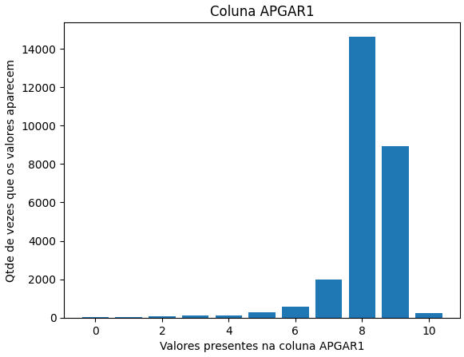
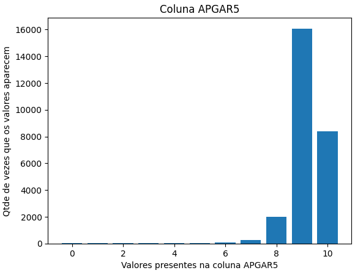
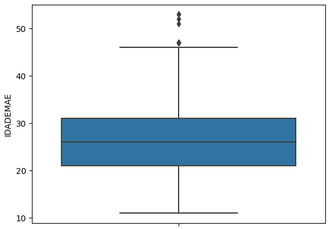
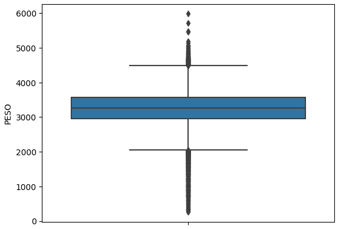
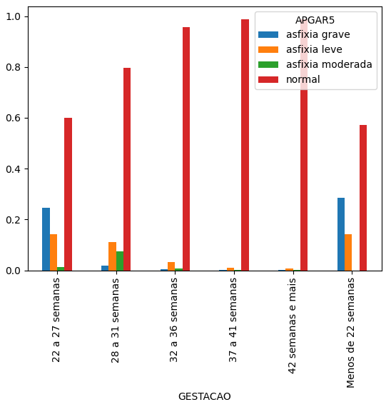

# 📈 Descritivas

Análise descritiva dos dados. Módulo 6 de Análise de Dados.

**Datasets**

- ``sinasc_RO_2019.csv``
- ``Estrutura_SINASC_para_CD.csv``


**Bibliotecas:**

```python
import pandas as pd
import matplotlib.pyplot as plt
import numpy as np
import seaborn as sns
```

**Links dos notebooks:**
1. [Descritiva 1](https://github.com/adrielleClemente/cientista_de_dados/blob/main/1.Python%20e%20An%C3%A1lise%20de%20Dados/Exerc%C3%ADcios%20Resolvidos/descritiva_mod06_tarefa_1.ipynb)
2. [Descritiva 2](https://github.com/adrielleClemente/cientista_de_dados/blob/main/1.Python%20e%20An%C3%A1lise%20de%20Dados/Exerc%C3%ADcios%20Resolvidos/descritiva_mod06_Tarefa_2.ipynb)
3. [Descritiva 3](https://github.com/adrielleClemente/cientista_de_dados/blob/main/1.Python%20e%20An%C3%A1lise%20de%20Dados/Exerc%C3%ADcios%20Resolvidos/descritiva_mod06_Tarefa_3.ipynb)


### Prévia de plots das análises

**Descritiva 1**

Gráficos de barras com as variáveis APGAR1, APGAR.






**Descritiva 2**

Boxplot da idade da mãe e do peso do bebê.






**Descritiva 3**

Gráfico de barras da tabela cruzada.



### Sobre as análises descritivas
A prática consiste em explorar os dados e conseguir cruzar informações para a visualização de gráficos.