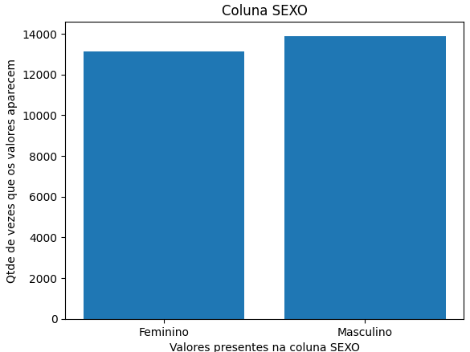
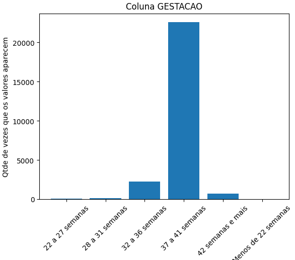
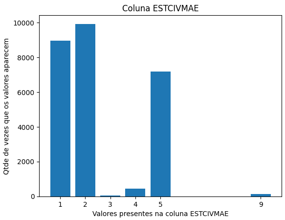

# Descritivas

Análise descritiva dos dados. Módulo 6 de Análise de Dados.

## Descritiva 1

**Link do notebook:** [Descritiva 1](https://github.com/adrielleClemente/cientista_de_dados/blob/main/1.Python%20e%20An%C3%A1lise%20de%20Dados/Exerc%C3%ADcios%20Resolvidos/descritiva_mod06_tarefa_1.ipynb)

**Dataset:** ``sinasc_RO_2019.csv``

**Bibliotecas:**

```python
import pandas as pd
import matplotlib.pyplot as plt
import numpy as np
import seaborn as sns
```

### Prévia de gráficos realizados no projeto
Gráficos de barras com as variáveis APGAR1, APGAR5, SEXO, GESTACAO, ESTCIVMAE.








