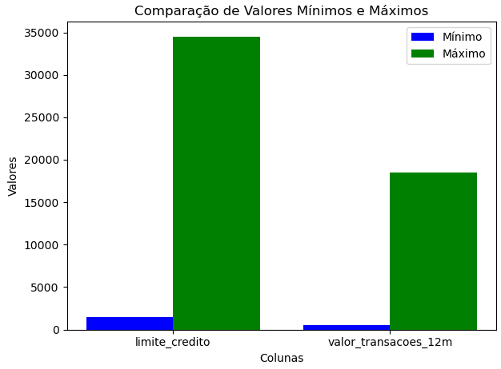

# Módulo 1: Analista de Dados

Diretório do Projeto Final do módulo **Análise de Dados**.

## Descrição do Projeto

Este projeto foi desenvolvido como parte do módulo de análise de dados do curso  **Cientista de Dados - EBAC** . O objetivo principal é analisar a relação entre o **valor das transações realizadas** e o **limite de crédito** dos clientes.

## Objetivo

* Explorar e entender a relação entre o valor total das
  transações realizadas pelos clientes em 12 meses e o limite de crédito
  oferecido.

## ⬆️ Estrutura do Projeto

### Informações do Dataset

O arquivo analisado contém as seguintes colunas principais:

* **id** : Identificação única do cliente.
* **default** : Indicador se o cliente está inadimplente (0 = não, 1 = sim).
* **idade** ,  **sexo** ,  **dependentes** ,  **escolaridade** ,  **estado_civil** , etc.
* **limite_credito** : Limite total disponível para o cliente (após conversão para float).
* **valor_transacoes_12m** : Valor total das transações realizadas nos últimos 12 meses (após conversão para float).

### 1. Exploração dos Dados

Os dados foram carregados a partir do arquivo `dados_credito.csv`. A exploração inicial incluiu:

* Verificação das primeiras linhas do dataset.
* Identificação de colunas, tipos de dados e possíveis valores ausentes.
* Contagem e análise de valores inconsistentes como "na" encontrados em algumas colunas, como `escolaridade` e `estado_civil`.

### 2. Limpeza e Transformação dos Dados

* Valores inconsistentes foram identificados e tratados, incluindo a remoção de valores "na".
* As colunas `limite_credito` e `valor_transacoes_12m`, originalmente no formato texto, foram convertidas para o formato numérico (`float`) para facilitar as análises.
* Após a limpeza, o dataset final contém  **8.500 registros válidos** , com 1.627 clientes em situação de inadimplência (`default = 1`).

### 3. Visualização dos Dados

Foram geradas visualizações para entender melhor os dados:

* **Distribuição dos tipos de cartão** : A maioria dos clientes possui cartões do tipo "blue".
* **Valores mínimos e máximos**
* Limite de crédito.
* Valor das transações em 12 meses.
* Soma total do valor das transações por tipo de cartão.
* Média do limite de crédito por tipo de cartão.

## Principais Resultados

1. A maior parte dos clientes utiliza cartões do tipo "blue", que também concentra a maior soma no valor total das transações.
2. O limite médio de crédito varia significativamente entre os tipos de cartão.

## Requisitos

Para executar o projeto, são necessárias as seguintes bibliotecas:

* `pandas`
* `numpy`
* `seaborn`
* `matplotlib`

## Como Executar

1. Certifique-se de ter os arquivos necessários (`dados_credito.csv`) na mesma pasta do script.
2. Execute o script no ambiente Jupyter Notebook ou similar.
3. Visualize as análises e gráficos gerados durante a execução.

## Conclusão

Este projeto demonstrou como explorar, limpar e
transformar dados para gerar insights úteis sobre o comportamento
financeiro dos clientes.

As visualizações criadas ajudam a identificar
tendências importantes relacionadas ao limite de crédito e ao volume
financeiro movimentado por diferentes tipos de cartões.