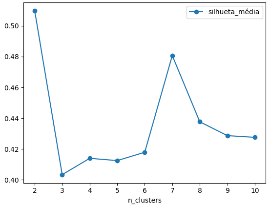
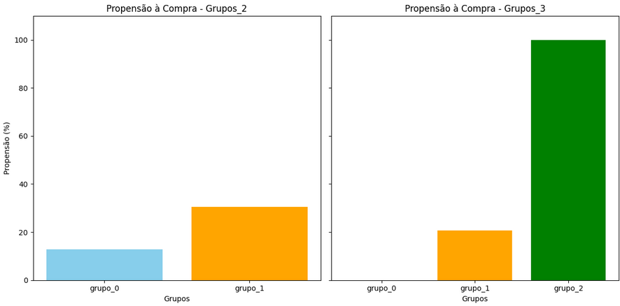

# 🛒 Intenção de Compradores Online | k-means

**Agrupamento de Clientes com base em Comportamento de Navegação**

Este projeto realiza uma análise de clusterização utilizando a base de dados Online Shoppers Purchasing Intention Dataset, com o objetivo de identificar perfis de clientes com diferentes comportamentos de navegação em uma loja virtual.

### Objetivo

Agrupar usuários de acordo com seu comportamento de navegação entre páginas administrativas, informativas e de produtos, visando entender se padrões distintos de navegação podem estar relacionados à propensão de compra.

### Fonte dos Dados

**Dataset:** [Online Shoppers Purchasing Intention Dataset](https://archive.ics.uci.edu/dataset/468/online+shoppers+purchasing+intention+dataset)

### Metodologia

1. Seleção de Variáveis: Foco nas 6 primeiras variáveis do conjunto de dados, relacionadas ao comportamento de navegação:

    - Administrative

    - Administrative_Duration

    - Informational

    - Informational_Duration

    - ProductRelated

    - ProductRelated_Duration

2. Pré-processamento

    - Padronização das variáveis numéricas com ``StandardScaler``.

3. Determinação do Número Ideal de Grupos

    - Uso do método do cotovelo (Elbow Method) com o algoritmo K-Means.

4. Clusterização

    - Aplicação do algoritmo K-Means com base no número de clusters ideal.

5. Análise dos Grupos

    - Visualização e interpretação dos grupos formados para entender os perfis de navegação.


### 🐍 Bibliotecas
```python
import pandas as pd
import matplotlib.pyplot as plt
import seaborn as sns

from sklearn.cluster import KMeans
from sklearn.preprocessing import StandardScaler

from tqdm.notebook import tqdm
from sklearn.metrics import silhouette_score
```


### Gráficos







### 📈 Resultados Esperados

Com os clusters definidos, identificar grupos com diferentes perfis de navegação, que possam futuramente ser correlacionados com variáveis como taxa de conversão ou propensão à compra.